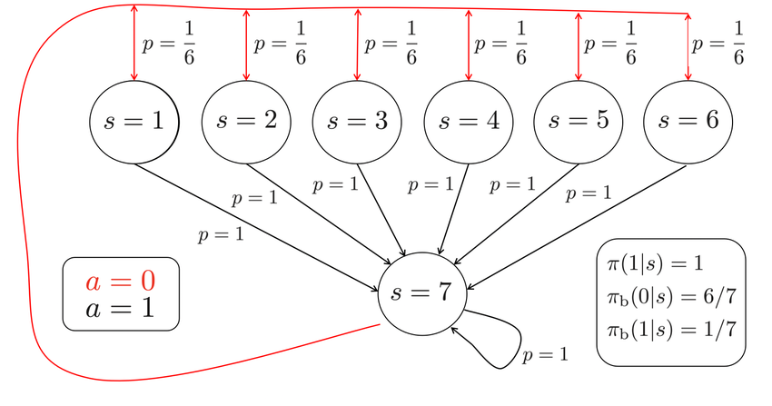

# Baird's Counterexample - Gymnasium Implementation
Baird's Counterexample is an environment that demonstrates a case where off-policy temporal-difference learning with
linear function approximation can diverge, even when the value function representable within the function approximator.

We implement this environment in Gymnasium, allowing an adjustable number of intermediate states for further experimentation
with larger and smaller state spaces. The schema for the environment (from [2]) can be seen below.


**Note:** in our environment, $a = 0$ is the action that leads to state $s = 0$ from every state. This diagram will be changed
when possible.
## Installation
```bash
git clone https://github.com/u7122029/bairds_counterexample_env.git
cd bairds_counterexample_env
pip install -e .
```
The `bairds_environment_env` is now in your python environment's packages.
## Usage
You may run the following code from anywhere, provided you are still on the same python environment:
```python
import gymnasium as gym
import bairds_counterexample_env

env = gym.make("bairds_counterexample_env-v0", num_intermediate_states=6)
state, _ = env.reset()
print(state)
env.step(1)
print(state)
```
## References
1. Baird, L. (1995). *Residual Algorithms: Reinforcement Learning with Function Approximation*. In Proceedings of the 12th International Conference on Machine Learning.
2. Li, Gen & Wu, Weichen & Chi, Yuejie & Ma, Cong & Rinaldo, Alessandro & Wei, Yuting. (2023). Sharp high-probability sample complexities for policy evaluation with linear function approximation. 10.48550/arXiv.2305.19001. 