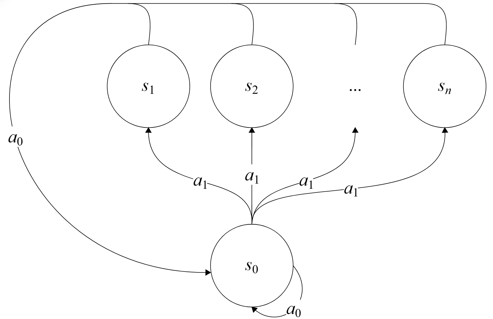

# Baird's Counterexample - Gymnasium Implementation
Baird's Counterexample is an environment that demonstrates a case where off-policy temporal-difference learning with
linear function approximation can diverge, even when the value function representable within the function approximator.

We implement this environment in Gymnasium, allowing an adjustable number of intermediate states for further experimentation
with larger and smaller state spaces. The schema for the environment can be seen below.

## References
1. Baird, L. (1995). *Residual Algorithms: Reinforcement Learning with Function Approximation*. In Proceedings of the 12th International Conference on Machine Learning.